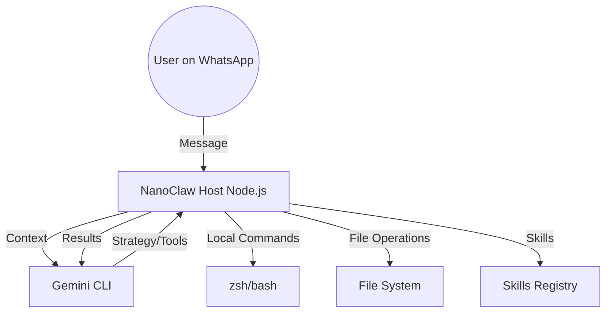

# NanoClaw (🐾)

> **High-Agency Personal Assistant: Bridging WhatsApp, Gemini, and System-Level Autonomy.**

NanoClaw 是一款专为 macOS 设计的、具备高度自治能力的个人助理系统。它不仅是一个聊天机器人，更是您系统的“远程代理”。通过 WhatsApp 界面，您可以指挥它完成复杂的软件工程任务、系统管理及日常工作流。

---

## 🌟 核心支柱 (Core Pillars)

### 1. 极简交互界面 (WhatsApp UI)
利用 WhatsApp 作为指令中心，支持文字、语音及文件传输。无论您身在何处，只要能发消息，就能控制您的 Mac。

### 2. 自治推理大脑 (Gemini CLI Brain)
集成最新的 Gemini CLI，采用 **Plan-Execute-Observe** 循环架构：
- **深度规划**：面对模糊需求，先给出多步逻辑推导。
- **工具调用**：自主决定何时使用 Shell 终端或写入文件。
- **实时反馈**：观察命令输出，自动修复错误或调整策略。

### 3. 安全执行环境 (Secure Execution)
- **Host 模式**：直接执行系统命令（如 git, brew, npm）。
- **Sandboxed 模式**：通过 `agent-runner` 容器隔离运行高风险代码，确保宿主机环境纯净。

### 4. 模块化技能库 (MCP Skills)
基于 Model Context Protocol (MCP) 标准，可通过 `.claude/skills/` 极速扩展能力：
- 📧 **Gmail**: 邮件检索与自动化处理。
- 🎙️ **Voice**: 高精度语音转文字。
- 🐦 **X (Twitter)**: 社交媒体自动化集成。
- 🚀 **Parallel**: 并行任务调度。
- 🐳 **Docker**: 动态构建与部署。

---

## 🏗️ 架构概览 (Architecture)



---

## 🚀 快速启动 (Getting Started)

### 前置条件
- **Node.js**: v20+
- **Gemini CLI**: 已完成授权 (`gemini login`)
- **macOS**: 核心运行环境

### 部署步骤
1. **安装依赖**:
   ```bash
   npm install
   ```
2. **账号关联**:
   ```bash
   npm run auth
   ```
   扫描终端出现的 QR Code 即可将您的 WhatsApp 账号与 NanoClaw 绑定。
3. **开启引擎**:
   ```bash
   npm run dev
   ```
   *助手默认响应指令词：` @小助手`*

---

## 📁 关键目录结构 (Project Structure)

- `src/`: 核心守护进程、消息路由与工具执行器。
- `.claude/skills/`: 存放所有可插拔的扩展技能。
- `container/`: `agent-runner` 的 Dockerfile 与隔离运行逻辑。
- `groups/`: 持久化记忆层，记录各群组的对话上下文与知识库。
- `workspace/`: Agent 执行任务时的临时“工作台”。
- `launchd/`: 包含 macOS 系统服务配置，支持开机自启。

---

## 📅 项目现状 (Status: 2026-02-05)

NanoClaw 目前处于 **Operational** 状态。最新的实验性功能（NanoClaw Lab）已上线，支持系统自动化巡检及动态网页生成。

- **WhatsApp ID**: 8617600663150
- **最新动态**: 已修复 WhatsApp 冲突重连逻辑，大幅提升系统稳定性。

---

## 📄 协议 (License)

本项目采用 MIT 协议。

🐾 *Generated by NanoClaw Autonomous Agent*